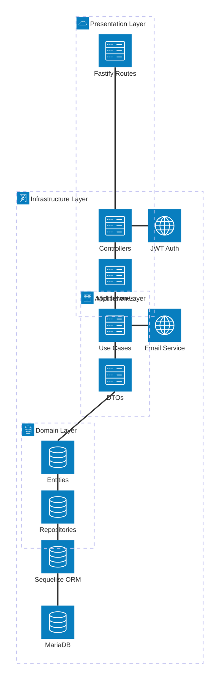

# Sistema de Login e Autenticação - Prefeitura

## Visão Geral

Este é um sistema de autenticação e gerenciamento de usuários desenvolvido para o ecossistema de aplicações da Prefeitura Municipal. O sistema implementa uma arquitetura limpa (Clean Architecture) com TypeScript, Fastify e Sequelize, proporcionando uma base sólida para controle de acesso, permissões e gerenciamento de usuários.

## Arquitetura do Sistema

O sistema segue os princípios da **Clean Architecture**, dividindo responsabilidades em camadas bem definidas:

### Diagrama de Arquitetura



### Camadas da Arquitetura

#### 1. Presentation Layer (Camada de Apresentação)
- **Routes**: Definição dos endpoints da API usando Fastify
- **Controllers**: Manipulação das requisições HTTP e respostas
- **Middlewares**: Autenticação JWT, autorização baseada em roles, rate limiting

#### 2. Application Layer (Camada de Aplicação)
- **Use Cases**: Lógica de negócio específica para cada operação
- **DTOs**: Objetos de transferência de dados para comunicação entre camadas

#### 3. Domain Layer (Camada de Domínio)
- **Entities**: Modelos de domínio (User, Role, Permission, etc.)
- **Repositories**: Interfaces para acesso a dados (padrão Repository)

#### 4. Infrastructure Layer (Camada de Infraestrutura)
- **Sequelize ORM**: Mapeamento objeto-relacional
- **MariaDB**: Banco de dados relacional
- **JWT**: Autenticação baseada em tokens
- **Nodemailer**: Serviço de envio de emails

## Tecnologias Utilizadas

### Backend
- **Fastify**: Framework web de alta performance
- **TypeScript**: Tipagem estática para JavaScript
- **Sequelize**: ORM para Node.js
- **MariaDB**: Banco de dados relacional
- **JWT**: Autenticação baseada em tokens
- **bcryptjs**: Hashing de senhas
- **Nodemailer**: Envio de emails

### Ferramentas de Desenvolvimento
- **tsx**: Executor TypeScript com watch mode
- **Sequelize CLI**: Gerenciamento de migrações
- **Swagger**: Documentação da API
- **Pino**: Logging estruturado

### Qualidade de Código
- **ESLint**: Linting de código
- **Prettier**: Formatação de código
- **Husky**: Git hooks
- **Commitlint**: Padronização de commits

## Instalação e Configuração

### Pré-requisitos
- Node.js 18+
- MariaDB 10.5+
- npm ou yarn

### Instalação

1. **Clone o repositório**
   ```bash
   git clone <repository-url>
   cd app_prefeitura_login
   ```

2. **Instale as dependências**
   ```bash
   npm install
   ```

3. **Configure as variáveis de ambiente**
   Copie o arquivo `.env.example` para `.env` e configure:
   ```env
   PORT=3000
   DB_HOST=localhost
   DB_PORT=3306
   DB_NAME=login_db
   DB_USER=your_user
   DB_PASS=your_password
   JWT_SECRET=your_jwt_secret
   EMAIL_HOST=smtp.gmail.com
   EMAIL_PORT=587
   EMAIL_USER=your_email@gmail.com
   EMAIL_PASS=your_app_password
   ```

4. **Execute as migrações do banco**
   ```bash
   npm run migrate
   ```

5. **Inicie o servidor em modo desenvolvimento**
   ```bash
   npm run dev
   ```

## Scripts Disponíveis

- `npm run dev`: Inicia o servidor em modo desenvolvimento com hot reload
- `npm run build`: Compila TypeScript para JavaScript
- `npm run start`: Inicia o servidor em produção
- `npm run check`: Verifica tipos TypeScript
- `npm run migrate`: Executa migrações do banco
- `npm run migrate:undo`: Desfaz última migração
- `npm run migrate:generate`: Gera nova migração baseada em mudanças

## Documentação da API

A API está documentada usando Swagger. Quando o servidor estiver rodando, acesse:
- **Swagger UI**: `http://localhost:3000/docs`

### Autenticação

O sistema utiliza JWT (JSON Web Tokens) para autenticação. Todas as rotas protegidas requerem o header:
```
Authorization: Bearer <token>
```

### Módulos e Rotas

#### 1. Auth (`/auth`)
Gerenciamento de autenticação e login.

**POST /auth/login**
- **Descrição**: Autentica usuário e retorna token JWT
- **Body**:
  ```json
  {
    "email": "string",
    "password": "string"
  }
  ```
- **Resposta**: Token JWT e dados do usuário

**GET /auth/auth**
- **Descrição**: Verifica validade do token
- **Headers**: Authorization: Bearer <token>
- **Resposta**: Dados do usuário autenticado

**POST /auth/refresh**
- **Descricao**: Renova o access token usando o refresh token em cookie HttpOnly
- **Cookie**: `refresh_token`
- **Resposta**: Novo access token e `{ "ok": true }`

**POST /auth/logout**
- **Descricao**: Revoga a sessao atual e limpa o cookie de refresh
- **Cookie**: `refresh_token`
- **Resposta**: `{ "ok": true }`

### Sessao e Refresh Token

- O access token JWT expira em 15 minutos e deve ser enviado em `Authorization: Bearer <token>`.
- O refresh token expira em 30 minutos, fica em cookie HttpOnly e nao deve ser lido pelo JavaScript.
- O cookie `refresh_token` usa `sameSite: "lax"`, `path: "/api"` e `secure: true` apenas em `NODE_ENV=production`.
- O frontend precisa usar `withCredentials: true` para enviar o cookie em `/refresh` e `/logout`.
- O CORS da API deve manter `credentials: true` e `CORS_ORIGINS` deve listar as origens permitidas do frontend.
- A politica atual e sessao unica: um novo login revoga sessoes anteriores do mesmo usuario.
- Execute `npm run migrate` antes de subir a versao com refresh token, pois a tabela `user_sessions` e obrigatoria.

#### 2. Users (`/user`)
Gerenciamento de usuários.

**GET /user**
- **Query Params**:
  - `limit` (number, default: 10)
  - `page` (number, default: 1)
  - `search` (string)
  - `order` (string, ex: "createdAt:desc")
- **Resposta**: Lista paginada de usuários

**GET /user/:id**
- **Parâmetros**: `id` (integer)
- **Resposta**: Dados do usuário específico

**POST /user**
- **Body**:
  ```json
  {
    "user": {
      "name": "string",
      "email": "string",
      "ramal": "string",
      "setor_id": "integer",
      "role_id": "integer"
    }
  }
  ```
- **Resposta**: Usuário criado

**PUT /user/:id**
- **Parâmetros**: `id` (integer)
- **Body**: Mesmo formato do POST
- **Resposta**: Usuário atualizado

**DELETE /user/:id**
- **Parâmetros**: `id` (integer)
- **Resposta**: Confirmação de exclusão

**PUT /user/alter_password**
- **Body**:
  ```json
  {
    "old_password": "string",
    "new_password": "string"
  }
  ```
- **Resposta**: Confirmação de alteração

#### 3. Roles (`/roles`)
Gerenciamento de roles/perfis.

**GET /roles**
- **Query Params**: limit, page, search, order
- **Resposta**: Lista de roles

**GET /roles/:id**
- **Parâmetros**: `id` (integer)
- **Resposta**: Role específica

**POST /roles**
- **Body**:
  ```json
  {
    "role": {
      "name": "string"
    }
  }
  ```
- **Resposta**: Role criada

**PUT /roles/:id**
- **Parâmetros**: `id` (integer)
- **Body**: Mesmo formato do POST
- **Resposta**: Role atualizada

**DELETE /roles/:id**
- **Parâmetros**: `id` (integer)
- **Resposta**: Confirmação de exclusão

#### 4. Permissions (`/permission`)
Gerenciamento de permissões.

**GET /permission**
- **Query Params**: page, limit, search, order
- **Resposta**: Lista de permissões

**GET /permission/:id**
- **Parâmetros**: `id` (integer)
- **Resposta**: Permissão específica

**PUT /permission/:id**
- **Parâmetros**: `id` (integer)
- **Body**:
  ```json
  {
    "permission": {
      "read": "boolean",
      "write": "boolean",
      "edit": "boolean",
      "del": "boolean"
    }
  }
  ```
- **Resposta**: Permissão atualizada

#### 5. Setor (`/setor`)
Gerenciamento de setores/departamentos.

**GET /setor**
- **Resposta**: Lista de setores

**GET /setor/:id**
- **Parâmetros**: `id` (integer)
- **Resposta**: Setor específico

**POST /setor**
- **Body**: Dados do setor
- **Resposta**: Setor criado

**PUT /setor/:id**
- **Parâmetros**: `id` (integer)
- **Body**: Dados atualizados
- **Resposta**: Setor atualizado

**DELETE /setor/:id**
- **Parâmetros**: `id` (integer)
- **Resposta**: Confirmação de exclusão

#### 6. Services (`/services`)
Gerenciamento de serviços/aplicações.

**GET /services**
- **Resposta**: Lista de serviços

**GET /services/user**
- **Resposta**: Serviços visíveis para o usuário logado com permissões

**GET /services/:id**
- **Parâmetros**: `id` (integer)
- **Resposta**: Serviço específico com visibilidade e permissões

**POST /services**
- **Body**:
  ```json
  {
    "service": {
      "name": "string",
      "description": "string",
      "url": "string"
    }
  }
  ```
- **Resposta**: Serviço criado

## Segurança

### Autenticação JWT
- Tokens com expiração configurável
- Refresh tokens para renovação automática
- Validação de tokens em cada requisição

### Autorização Baseada em Roles
- Controle de acesso granular por roles
- Middleware de autorização em cada rota
- Verificação de permissões específicas

### Rate Limiting
- Limitação de requisições por IP
- Configuração personalizável
- Proteção contra ataques de força bruta

### Validação de Dados
- Validação de entrada usando JSON Schema
- Sanitização de dados
- Prevenção de injeção SQL via ORM

### Criptografia
- Hashing de senhas com bcrypt
- Salt aleatório para cada senha
- Comparação segura de senhas

## Padrões de Design

### Repository Pattern
- Abstração do acesso a dados
- Facilita testes unitários
- Permite mudança de tecnologia de persistência

### Dependency Injection
- Injeção de dependências via factories
- Baixo acoplamento entre módulos
- Melhor testabilidade

### Event-Driven Architecture
- Eventos para controle de acesso
- Comunicação assíncrona entre módulos
- Extensibilidade do sistema

## Testes

### Estratégia de Testes
- **Unitários**: Testes de funções isoladas
- **Integração**: Testes de interação entre módulos
- **E2E**: Testes end-to-end da API

### Ferramentas
- **Jest**: Framework de testes
- **Supertest**: Testes de API HTTP
- **Mock**: Simulação de dependências

## Monitoramento e Logs

### Logging
- Pino para logging estruturado
- Níveis de log configuráveis
- Formatação pretty para desenvolvimento

### Métricas
- Contadores de requisições
- Tempos de resposta
- Taxas de erro

### Health Checks
- Endpoint de saúde da aplicação
- Verificação de conectividade com banco
- Status de dependências externas

## Desempenho

### Otimizações
- Cache de consultas frequentes
- Paginação em listagens
- Compressão de respostas

### Escalabilidade
- Stateless design
- Horizontal scaling possível
- Balanceamento de carga

## Desenvolvimento

### Estrutura de Pastas
```
src/
├── app.ts                 # Configuração principal da aplicação
├── server.ts              # Inicialização do servidor
├── core/                  # Componentes compartilhados
│   ├── env.ts            # Configurações de ambiente
│   ├── logConfig.ts      # Configuração de logs
│   ├── swaggerConfig.ts  # Configuração Swagger
│   ├── hooks/            # Hooks Fastify
│   ├── plugin/           # Plugins Fastify
│   ├── shared/           # Utilitários compartilhados
│   └── types/            # Tipos TypeScript
├── infra/                 # Camada de infraestrutura
│   └── database/         # Configuração do banco
├── modules/               # Módulos de negócio
│   ├── auth/             # Autenticação
│   ├── user/             # Usuários
│   ├── roles/            # Roles/perfis
│   ├── permission/       # Permissões
│   ├── setor/            # Setores
│   └── services/         # Serviços/aplicações
└── utils/                 # Utilitários
```

### Convenções de Código
- **Nomenclatura**: camelCase para variáveis/funções, PascalCase para classes
- **Commits**: Conventional Commits
- **Branches**: Git Flow
- **PRs**: Code review obrigatório

## Deploy

### Ambiente de Produção
- Build otimizado com TypeScript
- PM2 para gerenciamento de processos
- Docker para containerização
- CI/CD com GitHub Actions

### Variáveis de Ambiente
- Separação clara entre ambientes
- Secrets management
- Configuração via environment

## Suporte e Manutenção

### Documentação
- README abrangente
- Swagger para API
- Guias de desenvolvimento

### Monitoramento
- Logs centralizados
- Alertas automáticos
- Dashboards de métricas

### Backup e Recuperação
- Estratégia de backup do banco
- RPO/RTO definidos
- Testes de recuperação

---

**Desenvolvido com ❤️ para a Prefeitura Municipal**
